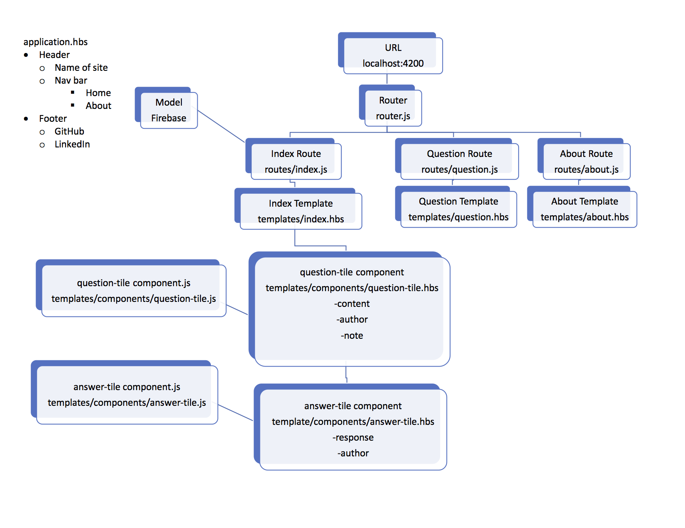

# Message Board

This app can be used as a message board for people interested in a career in development and looking to connect with fellow developers.

### By Nicole Santamaria

## Prerequisites

You will need the following things properly installed on your computer.

* [Git](https://git-scm.com/)
* [Node.js](https://nodejs.org/) (with NPM)
* [Ember CLI](https://ember-cli.com/)
* [PhantomJS](http://phantomjs.org/)

## Installation

* `git clone https://github.com/nrsantamaria/message-board`
* `cd message-board`
* `npm install`
* `bower install`

## Running / Development

* `ember serve`
* Visit your app at [http://localhost:4200](http://localhost:4200).

### Code Generators

Make use of the many generators for code, try `ember help generate` for more details

### Running Tests

* `ember test`
* `ember test --server`

### Building

* `ember build` (development)
* `ember build --environment production` (production)

### Deploying

Specify what it takes to deploy your app.

## Further Reading / Useful Links

* [ember.js](http://emberjs.com/)
* [ember-cli](https://ember-cli.com/)
* Development Browser Extensions
  * [ember inspector for chrome](https://chrome.google.com/webstore/detail/ember-inspector/bmdblncegkenkacieihfhpjfppoconhi)
  * [ember inspector for firefox](https://addons.mozilla.org/en-US/firefox/addon/ember-inspector/)

## Support and Contact Details
Please contact Nicole Santamaria at NicoleRSantamaria@gmail.com if you have any questions.

## License
This software is licensed under MIT license.

Copyright (c) 2017 Nicole Santamaria

